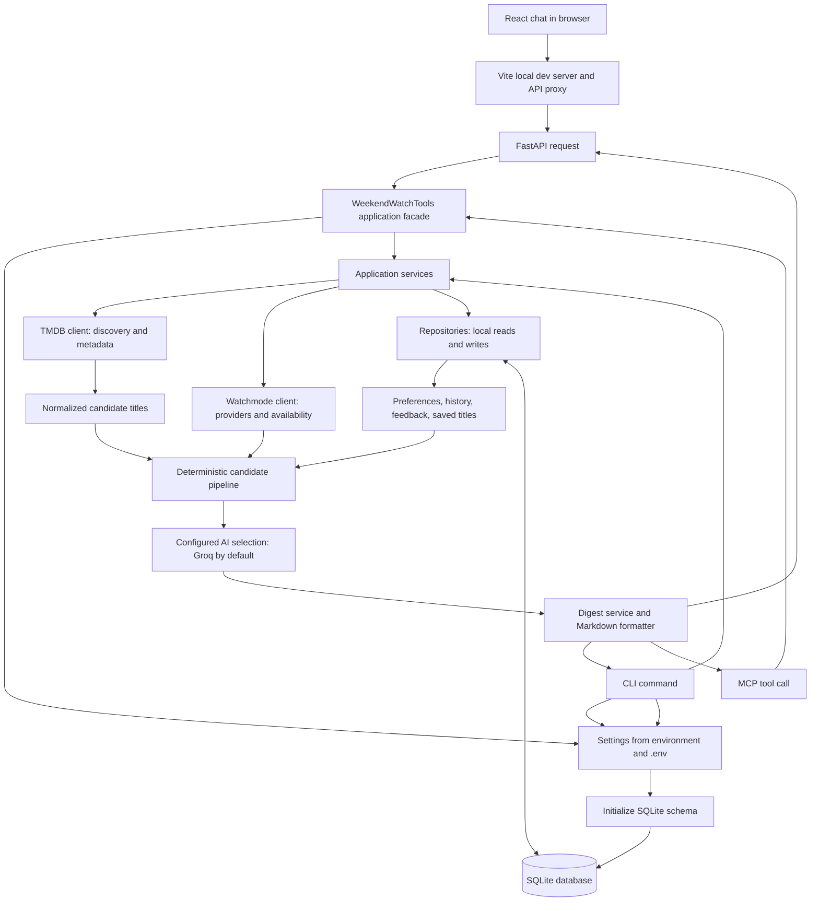

# Weekend Watch Agent: Execution Architecture

This document describes how the local application starts, how its main commands move through the code, and how external services and SQLite fit together.

## High-level flow



## Process startup and configuration

The installed `weekend-watch`, `weekend-watch-api`, and `weekend-watch-mcp` commands enter through `weekend_watch.cli:main`, `weekend_watch.api:main`, and `weekend_watch.mcp_server:main`. The equivalent module commands are `python -m weekend_watch.cli`, `python -m weekend_watch.api`, and `python -m weekend_watch.mcp_server`.

`config.Settings` reads provider credentials, database path, region, model selection, and API host/port from environment variables and `.env`. `get_settings()` caches the settings object for the process. Credentials are passed to their provider clients; they are not returned by application tools.

Commands that need persistence call `initialize_database()` and open a SQLite connection with `connect()`. Initialization creates or upgrades tables. Connections enable foreign keys and use the repository's SQLite concurrency settings. Repository classes own SQL for titles, watch history, preferences, feedback, watch-later entries, recommendation history, provider mappings, and availability cache rows.

## Recommendation and digest execution

The `recommend` and `digest` CLI commands, the HTTP digest endpoint, and the corresponding MCP tools share `build_recommendation_pipeline()` and the recommendation services.

1. **Discover titles.** `RecommendationPipeline` asks `TmdbClient` for enabled sources: trending movies and TV, recent releases, highly rated titles, and hidden-gem discovery. TMDB payloads become normalized Pydantic `Title` models.
2. **Deduplicate and filter.** The pipeline deduplicates TMDB results by TMDB ID while collecting their source categories. It removes watched and not-interested titles and applies media, genre, rating, language, and streaming-service preferences.
   For explicit chat requests, TMDB Discover is also queried by the requested genre and media type so a broad popularity shortlist cannot hide every matching title. Request filters then enforce the requested genre/media type from TMDB and provider/region from confirmed Watchmode availability.
3. **Resolve availability.** When configured, `WatchmodeService` maps TMDB IDs to distinct Watchmode IDs, looks up regional sources, and caches normalized providers, URLs, offer types, and prices in SQLite. A missing match is treated as unavailable; transient/provider errors use unexpired cache when present. Without a Watchmode key, the pipeline can use cached availability.
4. **Rank deterministically.** Candidate categories and a configurable weighted match score are calculated from source metadata, preferences, release recency, trend status, ratings, and confirmed availability.
5. **Select with the configured AI stage.** `AI_RECOMMENDATION_PROVIDER` defaults to `groq`, which selects only from supplied candidate IDs. `claude` or `auto` enables Claude final selection; `deterministic` disables AI. Provider errors fall back to deterministic ranking. Explicit genres in a request are checked against TMDB genre metadata before selection and remain enforced in fallback.
6. **Format results.** `WeekendDigestService` creates the Recommended, New This Week, and Hidden Gems sections. `format_weekend_digest()` renders Markdown. The CLI prints it and can save a timestamped copy under `data/digests/`; the HTTP API and MCP tool return both structured data and Markdown.

TMDB supplies title facts such as title, genre, rating, date, and synopsis. Watchmode supplies availability. AI selects candidates and contributes concise matching text; it does not provide factual metadata.

## Other entry paths

### React chat

The Vite development server serves the React chat from `web/` and proxies `/health` and `/api` requests to the local FastAPI process. The UI posts each submitted prompt and requested result limit to `/api/weekend-digest`, then renders the returned structured digest as conversation cards. Chat turns stay in browser memory and are not saved to SQLite.

### CLI

- `health` initializes/checks the SQLite database and does not call external services.
- `tmdb-trending` searches TMDB, normalizes results, and persists them through `TmdbService` and `TitleRepository`.
- `availability` uses `WatchmodeService` and the `WatchmodeRepository` ID mapping/cache.
- `watched` resolves a supplied title through TMDB, saves its normalized identity, and records a watch event through `PersonalizationService`.
- `history` and `preferences` read the local profile through `PersonalizationService`.
- `weekend-candidates`, `recommend`, and `digest` run progressively higher-level parts of the same recommendation pipeline.

### HTTP API for n8n

`GET /health` checks local database initialization/connectivity. `POST /api/weekend-digest` validates the requested limit and prompt, calls `WeekendWatchTools.get_weekend_digest()`, and returns a structured digest plus Markdown. The default listener is local-only (`127.0.0.1`).

### MCP server

The MCP server communicates over stdio. Tool definitions in `mcp_server.py` delegate to `WeekendWatchTools`; that facade invokes the same clients, services, repositories, and digest pipeline used by the CLI/API. MCP handlers do not implement their own provider or SQL logic.

## External clients and resource lifetime

TMDB, Watchmode, Groq, and Claude integrations are isolated in their provider clients. Application services call those clients and translate normalized models into repository operations. The CLI and facades scope clients with context managers/`ExitStack`, so owned HTTP connections close when each operation finishes. Tests substitute mocked HTTP transports and injected services rather than requiring live credentials.

## Main modules

| Module | Responsibility |
| --- | --- |
| `config.py` | Environment and `.env` settings |
| `database.py` | SQLite schema, initialization, and connections |
| `repositories.py` | SQL data-access layer |
| `tmdb/` | TMDB HTTP client, normalized models, and service |
| `watchmode/` | Watchmode HTTP client, ID mapping, and availability service |
| `personalization/` | Preferences and personal watch/feedback operations |
| `recommendations/pipeline.py` | Candidate discovery, filtering, categories, and scoring |
| `recommendations/request_filters.py` | Enforce explicit genre, media type, and streaming-service constraints |
| `recommendations/ai.py` | Optional structured Groq/Claude selection and fallback |
| `recommendations/digest.py` | Digest selection and Markdown rendering |
| `recommendations/runtime.py` | Shared assembly of pipeline and AI clients |
| `mcp_tools.py` | Application facade shared by MCP and HTTP API |
| `mcp_server.py` | MCP stdio tool declarations |
| `api.py` | FastAPI health and weekend-digest routes |
| `cli.py` | Local command-line interface |
| `web/` | React/Vite chat client for the digest API |

## Run locally

From the repository root, activate the project environment and use:

```sh
python -m weekend_watch.cli health
python -m weekend_watch.cli digest
python -m weekend_watch.api
python -m weekend_watch.mcp_server
```
